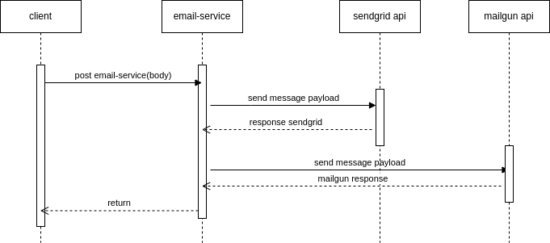

# Email Service

### Challenge 

Create a service that accepts the necessary information and sends emails. It should provide an abstraction between two different email service providers. If one of the services goes down, your service can quickly failover to a different provider without affecting your customers.

Email Providers used:
- SendGrid
- Mailgun

### Technical track
back-end

### Description
It is build in nodejs and Nestjs as framework .

For this challenge I decided to use nestj because of the structure and added value that it offers.

I have experience using express in node but I have experience too in python 
frameworks like flask or django, I think that nestjs is great for enterprise applications
by the implicit SOLID principles, and others patterns like decorators, ts, guards, interceptor, etc..
for me these give an advantage and reliability to build software from the backend and I enjoy it.

### API info

HEALTH CHECK
- GET https://morning-depths-69843.herokuapp.com/health
- to check if the service is up

URL:
- https://morning-depths-69843.herokuapp.com/email-handler/api/v1/send-email

Method:<br> 
  -  POST

Input:
- One from email address
- email subject
- email content

input format: json

JSON key | Meaning
-------- | -------
to       | string or list, the to email address(es)
subject  | the email subject
text     | full text content of the email to be sent


Following is a sample input json:
```
{

    'to':['test1@mail.com, test2@mail.com'],
    'subject':'test subject',
    'text':'This is the test text as the email content. Again, this is the test text as the email content.'
}
```

output:
- id
- message

output format: json

Following is a sample output json:
```
{'id':string, 'message':string}
```

### Sequence Diagram



The request starts from the front end through a form, sends the entered data to the 
email-service api where the controller receives the payload and is then transported to the 
service layer where the repositories are called and the process is evaluated. 
status of the request to the external apis
if one of them fails, a change is made to the next provider
to finally respond to the client successfully


### Form Client
- https://stunning-rabanadas-934811.netlify.app/


## Installation

```bash
$ npm install
```

## Running the app

```bash
# development
$ npm run start

# watch mode
$ npm run start:dev

# production mode
$ npm run start:prod
```

## Test

```bash
# unit tests
$ npm run test

# e2e tests
$ npm run test:e2e

# test coverage
$ npm run test:cov
```


